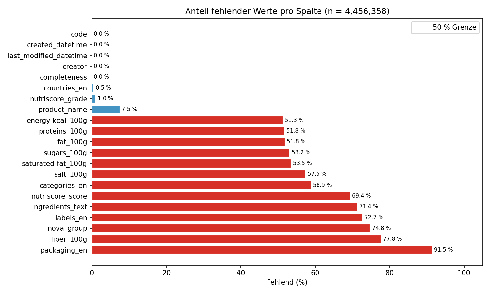
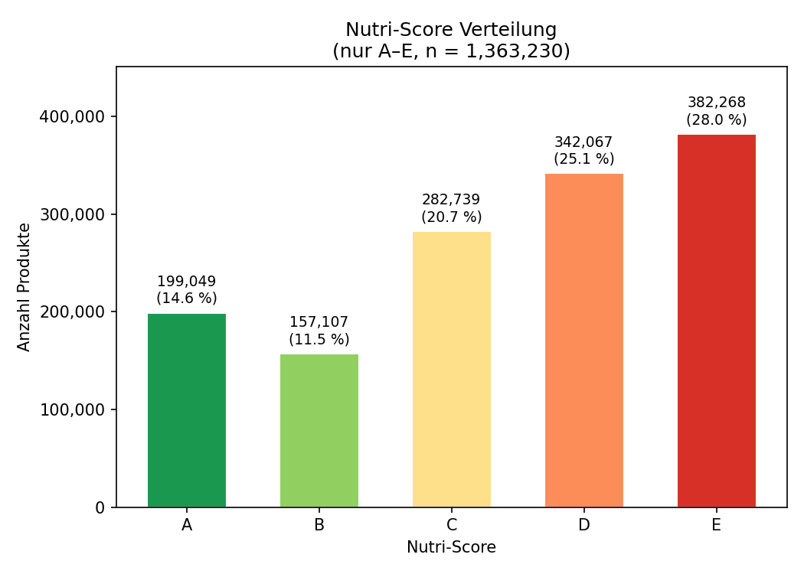
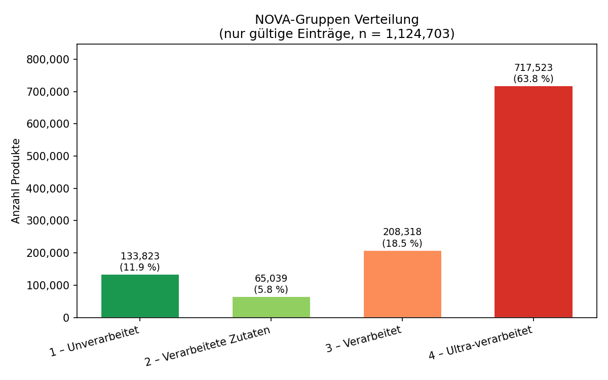
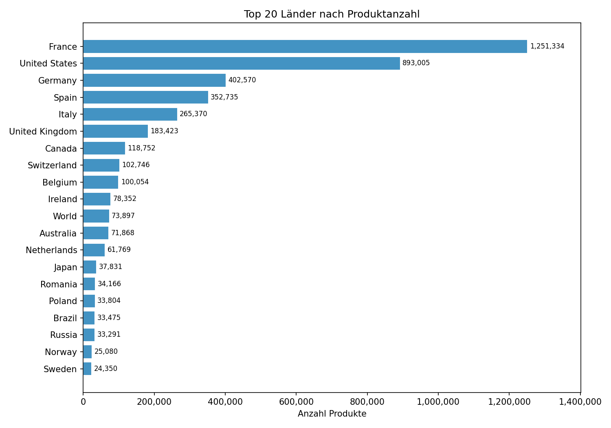
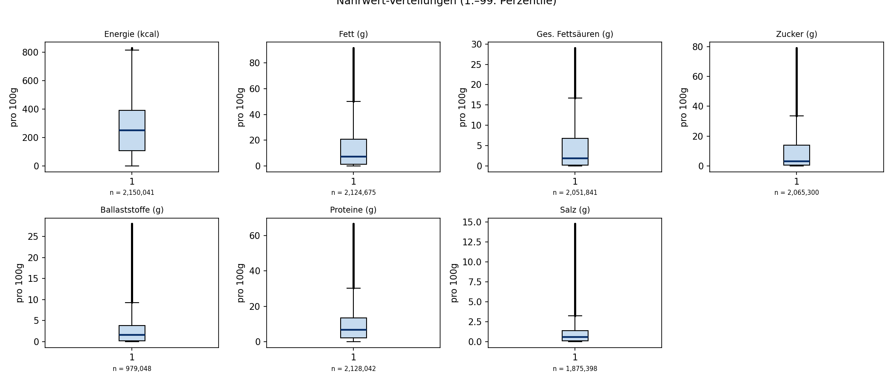
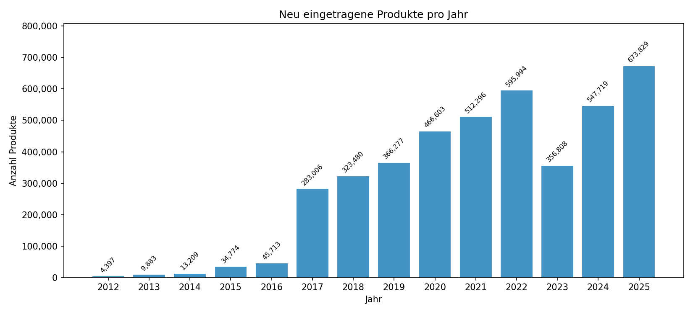
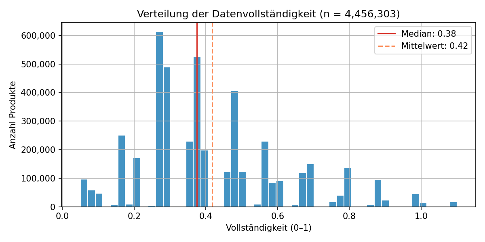

# Open Food Facts — Meilenstein 1

---

## Auf einen Blick

| Kennzahl               | Wert |
|:---|---:|
| Produkte gesamt        | **4.456.358** |
| Mit Produktname        | 4.122.743 — 92,5 % |
| Mit Länderangabe       | 4.433.355 — 99,5 % |
| Mit Nutri-Score (A–E)  | 1.363.230 — **30,6 %** |
| Mit NOVA-Gruppe (1–4)  | 1.124.703 — **25,2 %** |
| Mit Nährwertdaten      | 2.168.831 — 48,7 % |
| Zeitraum               | 2012 – 2025 |
| Häufigster Nutri-Score | **E** (schlechteste Note) |
| Häufigste NOVA-Gruppe  | **4 – Ultra-verarbeitet** (63,8 %) |
| Median Vollständigkeit | **37,5 %** |

> **Kernbotschaft:** Open Food Facts ist eine freiwillig gepflegte Datenbank. Die meisten Produkte sind unvollständig eingetragen, stark auf Westeuropa konzentriert, und verarbeitete Fertigprodukte sind deutlich überrepräsentiert.

---

## 1. Fehlende Werte

Rote Balken = über 50 % der Einträge fehlen. Blau = unter 50 %.

| Spalte              | Fehlend    | Bewertung |
|:---|---:|:---|
| `packaging_en`      | **91,5 %** | 🔴 Nicht verwendbar |
| `fiber_100g`        | **77,8 %** | 🔴 Sehr lückenhaft |
| `nova_group`        | **74,8 %** | 🔴 Nur ~25 % auswertbar |
| `labels_en`         | 72,7 %     | 🔴 Sehr lückenhaft |
| `ingredients_text`  | 71,4 %     | 🔴 Sehr lückenhaft |
| `nutriscore_score`  | 69,4 %     | 🔴 Sehr lückenhaft |
| `categories_en`     | 58,9 %     | 🟡 Eingeschränkt nutzbar |
| Nährwerte (`_100g`) | 51–58 %    | 🟡 Reinigung nötig |
| `product_name`      | 7,5 %      | 🟢 Gut nutzbar |
| `countries_en`      | 0,5 %      | 🟢 Sehr vollständig |
| `code`, Zeitstempel | **0 %**    | 🟢 Vollständig |

> **Warum so viele Lücken?** Freiwillige scannen oft nur den Barcode und den Produktnamen. Nährwerte müssen manuell von der Verpackung abgetippt werden — das macht kaum jemand. `code` und Zeitstempel werden automatisch vom System erzeugt und sind deshalb immer vorhanden.

---

## 2. Nutri-Score

Der Nutri-Score bewertet die Nährwertqualität auf einer Skala von **A (gesund)** bis **E (ungesund)**.

Nur **30,6 %** aller Produkte haben einen gültigen A–E Score. Der Rest hat entweder keinen Score oder den Platzhalterwert `"unknown"`.

| Note  |                  | Anzahl      | Anteil |
|:---:|:---|---:|---:|
| **A** | 🟢 sehr gut      | 199.049     | 14,6 % |
| **B** | 🟡 gut           | 157.107     | 11,5 % |
| **C** | 🟠 mittel        | 282.739     | 20,7 % |
| **D** | 🔶 schlecht      | 342.067     | 25,1 % |
| **E** | 🔴 sehr schlecht | **382.268** | **28,0 %** |

> **Warum dominiert Note E?** Nicht weil die Welt so ungesund isst — sondern weil Fertigprodukte (Chips, Softdrinks, Tiefkühlkost) mit Barcodes häufiger in die Datenbank eingetragen werden als frisches Obst und Gemüse. Das ist ein **Selektions-Bias**, kein reales Bild der Ernährung.

---

## 3. NOVA-Gruppen

NOVA klassifiziert Lebensmittel nach dem **Grad der industriellen Verarbeitung** — unabhängig vom Nährwert.

| Gruppe|   | Bedeutung                                                  | Anzahl     | Anteil |
|:---:|:---:|:---|---:|---:|
| **1** | 🟢 | Unverarbeitet (Obst, Gemüse, Fleisch, Eier)               | 133.823     | 11,9 % |
| **2** | 🟡 | Verarbeitete Zutaten (Öle, Mehl, Butter, Zucker)          | 65.039      | 5,8 %  |
| **3** | 🟠 | Verarbeitet (Konserven, Käse, Brot, Wurstwaren)           | 208.318     | 18,5 % |
| **4** | 🔴 | **Ultra-verarbeitet (Snacks, Limonaden, Fertiggerichte)** | **717.523** | **63,8 %** |

Nur **25,2 %** aller Produkte haben eine gültige NOVA-Gruppe. Fehlerhafte Einträge (z. B. `138`, `"Italie"`) wurden herausgefiltert.

> **Selektions-Bias hier noch stärker:** Gruppe 2 (z. B. reines Öl oder Mehl) wird kaum als Einzelprodukt eingetragen. Gruppe 4-Produkte dagegen sind verpackt, haben Barcodes und werden massenhaft gescannt. Das Verhältnis 64 % zu 12 % spiegelt die Datenbankstruktur wider — nicht den tatsächlichen Konsum.

---

## 4. Top 20 Länder

Ein Produkt kann mehreren Ländern zugeordnet sein. Jede Nennung wurde einzeln gezählt.

| #  | Land              | Produkte |
|:---:|:---              |---:       |
| 1  | 🇫🇷 Frankreich     | 1.251.334 |
| 2  | 🇺🇸 USA            | 893.005 |
| 3  | 🇩🇪 Deutschland    | 402.570 |
| 4  | 🇪🇸 Spanien        | 352.735 |
| 5  | 🇮🇹 Italien        | 265.370 |
| 6  | 🇬🇧 Großbritannien | 183.423 |
| 7  | 🇨🇦 Kanada         | 118.752 |
| 8  | 🇨🇭 Schweiz        | 102.746 |
| 9  | 🇧🇪 Belgien        | 100.054 |
| 10 | 🇮🇪 Irland         | 78.352  |

> **Warum Frankreich so dominant?** Open Food Facts wurde 2012 in Frankreich gegründet und hat dort die größte Freiwilligen-Community. Frankreich allein macht **28 %** aller Produkte aus. Das ist ein starker **geografischer Bias** — Analysen lassen sich nicht einfach auf andere Regionen übertragen.

---

## 5. Nährwerte pro 100g

Die Boxplots zeigen die Verteilung zwischen dem 1. und 99. Perzentil. Die fette blaue Linie ist der **Median** — der verlässlichere Wert, weil er nicht von Ausreißern verzerrt wird.

| Nährwert              | Median       | Typischer Bereich (25–75 %) |
|:---|---:|:---:|
| Energie               | **254 kcal** | 109 – 394 kcal |
| Fett                  | **7,3 g**    | 1,2 – 21,0 g |
| Gesättigte Fettsäuren | **1,9 g**    | 0,2 – 7,0 g |
| Zucker                | **3,2 g**    | 0,6 – 14,4 g |
| Ballaststoffe         | **1,7 g**    | 0,2 – 3,9 g |
| Proteine              | **6,7 g**    | 2,0 – 14,0 g |
| Salz                  | **0,57 g**   | 0,1 – 1,4 g |

> **Datenfehler-Warnung:** Die Rohdaten enthalten massive Ausreißer — negative Kalorienwerte, astronomisch hohe Zahlen (z. B. Zuckerwert von 10³³ g), falsche Einheiten (kJ statt kcal). Der **Mittelwert ist deshalb wertlos** — nur Median und Perzentile sind interpretierbar. Vor jeder weiteren Analyse müssen Nährwerte bereinigt werden.

---

## 6. Einträge pro Jahr

| Zeitraum    | Entwicklung |
|:---:|:---|
| 2012 – 2016 | 📈 Langsamer Aufbau: 4.000 → 46.000 Produkte/Jahr |
| **2017**    | 🚀 **Sprung auf 283.000** — Mobile App-Launch, breite Öffentlichkeit |
| 2018 – 2022 | 📈 Stetiges Wachstum bis 596.000/Jahr |
| 2023        | 📉 Einbruch auf 357.000 — Ursache unklar |
| 2024 – 2025 | 🏆 Neue Höchstwerte: 548.000 → **674.000** |

> **Hinweis zu 2025:** Der Datensatz wurde möglicherweise vor Jahresende exportiert. 674.000 könnte also noch unvollständig sein und am Ende des Jahres höher liegen.

---

## 7. Datenvollständigkeit

Der `completeness`-Wert ist ein Plattform-Score von 0 bis 1, der misst, wie viele Felder ein Produkt ausgefüllt hat.

| Kennzahl               | Wert |
|:---|---:|
| Mittelwert             | 0,417 |
| **Median**             | **0,375** |
| Unteres Quartil (25 %) | 0,275 |
| Oberes Quartil (75 %)  | 0,500 |
| Maximum                | 1,1 *(Plattform-Artefakt)* |

Das Histogramm zeigt einen deutlichen Peak bei ~0,35 — die meisten Produkte sind knapp über ein Drittel vollständig. Nur sehr wenige Einträge erreichen 0,75 oder mehr.

> **Praktische Empfehlung:** Für zukünftige Analysen lohnt es sich, nur Produkte mit `completeness >= 0,5` zu verwenden. Das reduziert den Datensatz auf das obere Viertel, verbessert aber die Datenqualität erheblich.

---

## Fazit & Empfehlungen für Meilenstein 2

### Zusammenfassung für die Präsentation

Open Food Facts ist eine der größten öffentlich zugänglichen Lebensmitteldatenbanken der Welt — mit über **4,4 Millionen Produkten** aus mehr als 180 Ländern, gepflegt ausschließlich von Freiwilligen seit 2012.

Die Analyse zeigt: Die Datenbank ist **groß, aber lückenhaft.** Der typische Eintrag ist nur zu **37,5 % vollständig** — die meisten Nutzer scannen einen Barcode und tragen kaum weitere Details ein. Das führt dazu, dass zentrale Felder wie Nährwerte (~51 % fehlend), NOVA-Gruppe (~75 % fehlend) und Nutri-Score (~70 % fehlend) nur für eine Minderheit der Produkte verfügbar sind.

Zwei strukturelle Verzerrungen prägen den gesamten Datensatz:

- **Geografischer Bias:** Frankreich stellt allein 28 % aller Produkte. Westeuropa und Nordamerika dominieren. Asien, Afrika und Südamerika sind stark unterrepräsentiert.
- **Produkttyp-Bias:** Verpackte, ultra-verarbeitete Produkte mit Barcode werden viel häufiger eingetragen als frische, unverarbeitete Lebensmittel. Das erklärt, warum der häufigste Nutri-Score **E** ist und 64 % der klassifizierten Produkte zur NOVA-Gruppe 4 (ultra-verarbeitet) gehören — nicht weil die Welt so schlecht isst, sondern weil diese Produkte in der Datenbank überrepräsentiert sind.

Trotz dieser Einschränkungen bietet der Datensatz eine einzigartige Grundlage: Er erlaubt es, **Muster in der globalen Lebensmittelverarbeitung, Nährwertqualität und geografischen Verteilung** zu untersuchen — solange die Verzerrungen bei der Interpretation berücksichtigt werden.

---

### Empfehlungen für Meilenstein 2

| Thema | Befund | Handlungsbedarf |
|---|---|---|
| Datenmenge | 4,46 Mio. Produkte — sehr groß | Filtern statt alles verwenden |
| Vollständigkeit | Median 37,5 % | Grenzwert `completeness >= 0,5` setzen |
| Nährwerte | Massive Ausreißer und Fehler | Bereinigung vor jeder Analyse |
| Nutri-Score | Nur 30,6 % haben einen gültigen Score | Immer als Teilmenge ausweisen |
| NOVA | Nur 25,2 % mit gültiger Gruppe | Selektions-Bias kommunizieren |
| Geografie | 28 % Frankreich, westeuropäisch dominiert | Länder-Subgruppen bilden |
| Verarbeitungsgrad | 63,8 % ultra-verarbeitet | Kein Abbild der realen Ernährung |
